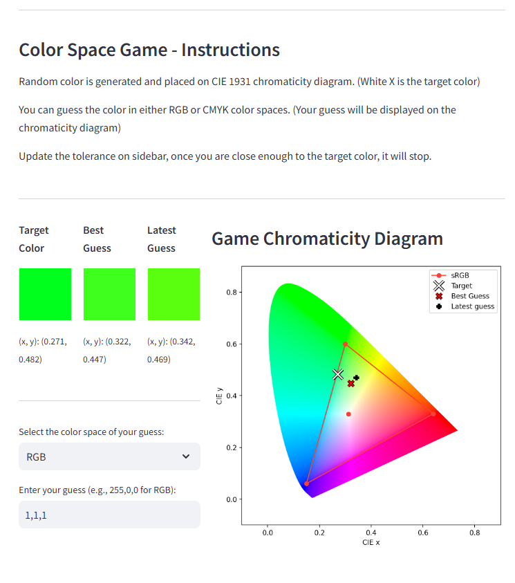

### Color Spaces
Generates a random RGB color, converts it to CIE 1931 color space and plots on the plane. You can use RGB or CMYK to find the location of it on the place. [Link to the game on streamlit](https://colorspaces.streamlit.app/)

